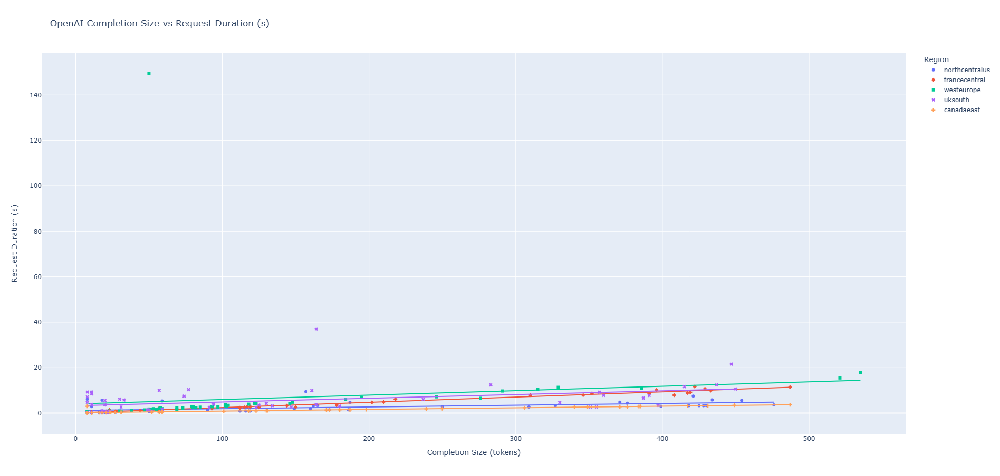
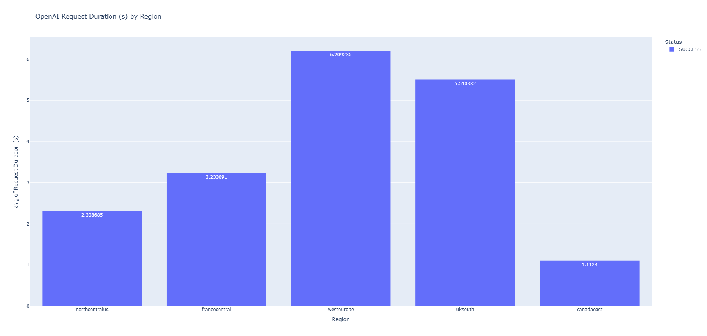
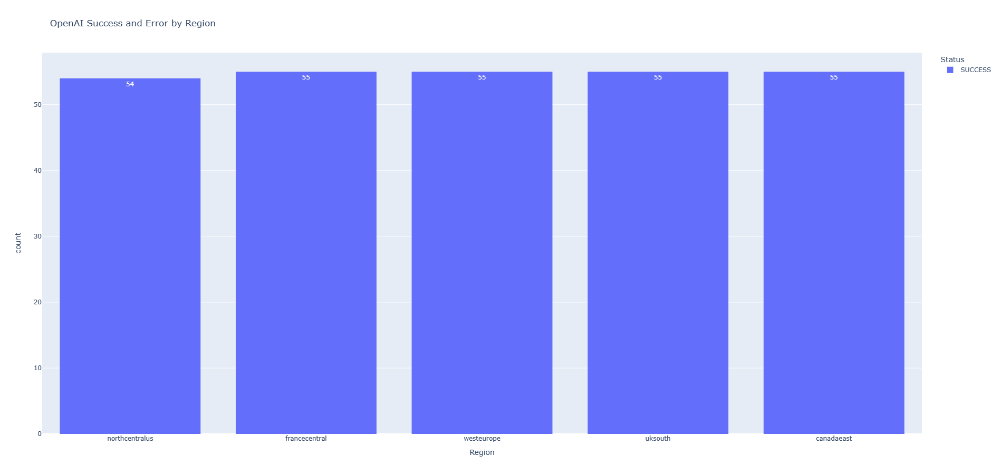
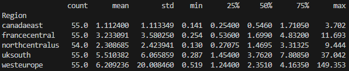

# Performance Azure OpenAI Regions

### Prerequisites

#### To Run Locally

* [Python 3+](https://www.python.org/downloads/)
  * **Important**: Python and the pip package manager must be in the path in Windows for the setup scripts to work.
* .env file
  * **Important**: Follow the example *env_sample.txt* file to create a .env file.
* Run code
  * **Important**: *main_openai.py* is the initial code to run.

 >NOTE: The code will generate the log file in the folder *./Logs*.

### Generate Graphs from the Logs

You can generate some graphs from the logs in order to compare the performance of the different regions. There are some types of graphs that can be generated, and they are described below.:

* Scatter
  * Example of a Scatter graph:
  

* Histogram
  * Example of a Histogram graph of the average time:
  

  * Example of a Histogram graph of the number of requests Successful and Failed:
  

* Statistics

  

#### To Generate Graphs

* Run code
  * **Important**: *dataframe_log.py* is the code to run.

>NOTE: Need to specify the path of the log file in the code.
